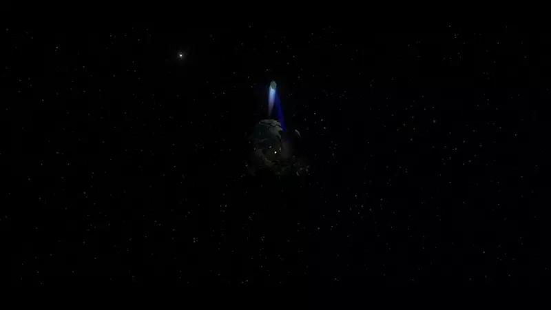

# 

# Wacky Rotations
An absolutely stupid mod inspired by the wonderful tomfoolery I experienced while playing PacificEngines [Randomizer Mod](https://outerwildsmods.com/mods/randomizer/). Gives the player some control over
the rotational behaviour of the Outer Wilds planets, moon and comet. This mod is not meant to be used in any serious manner, and it's incredibly easy to accidentally kill yourself with it.

# What Exactly Does This Mod Do?
Specifically, this mod allows the planets to spin in any direction with a speed specified by the player. Additionally, the planets can randomly change spin directions, with the time between changes also
being controlled by the player.

# Bodies
Most of the planetary bodies can be manipulated with this mod. Specifically, the following bodies can be controlled:
* Ash Twin 
* Ember Twin 
* Timber Hearth 
* The Attelrock 
* Brittle Hollow 
* Hollow's Lantern 
* Giant's Deep 
* Dark Bramble 
* The Interloper

# Settings
Each body that can be manipulated has the following settings: 
* **Rotation Speed** - The speed with which the body will rotate, in rotations/sec. 
* **TTC** - The time (in seconds) between rotation changes. 